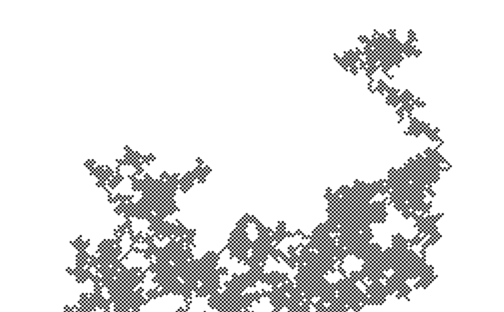

# Experimento
1. Voy a modificar el código para que el walker sólo pueda desplazarse diagonalmente.
2. Que posibilidades y restricciones tengo para que el walker se mueva diagonalmente en 4 ejes diagonales?
3. Espero que al llenarse la pantalla se recree un tablero de ajedrez.
4. El walker se movió  en los 4 ejes diagonales y formo un tablero de ajedrez al llenarse la pantalla.
5. Aprendí que mediante una selección aleatoria puedo generar un camino impredecible sobre un canvas.
6.

``` js
class Walker {
 constructor() {
    this.x = width / 2;
    this.y = height / 2;
  }
   show() {
    stroke(0);
    point(this.x, this.y);
  }
  step() {
    let choice = floor(random(4));
    if (choice === 0) {
      this.x++;
      this.y--;
    } else if (choice === 1) {
      this.x--;
      this.y++;
    } else if (choice === 2) {
      this.y++;
      this.x++;
    } else {
      this.y--;
      this.x--;
    }
  }
}

function setup() {
  createCanvas(640, 240);
  walker = new Walker();
  background(255);
}

function draw(){
  walker.step ();
  walker.show ();
}
```
7. 
