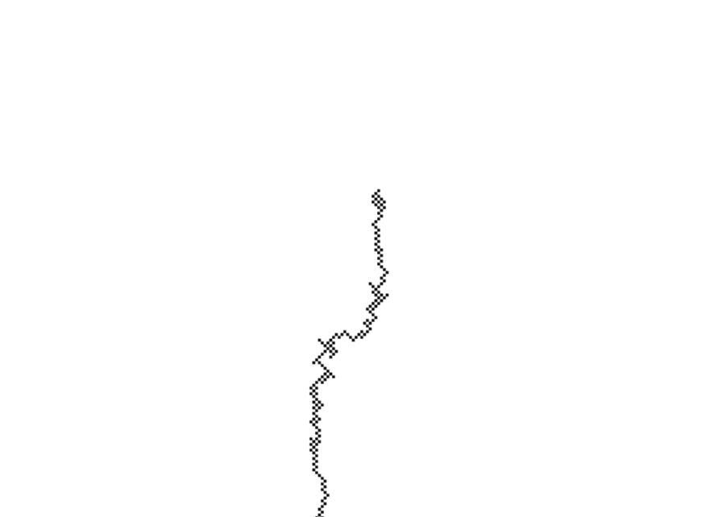

# Explicación
1. Una distribución uniforme arroja valores en la misma proporción dentro de un rango, mientras la no uniforme
   puede tener tendencia hacia un valor en concreto.
2.
``` js
   class Walker {
   constructor() {
    this.x = width / 2;
    this.y = height / 2;
    }
   show() {
    stroke(0);
    point(this.x, this.y);
    }
    step() {
    let choice = floor(randomGaussian(2));
    if (choice === 0) {
      this.x++;
      this.y--;
    } else if (choice === 1) {
      this.x--;
      this.y++;
    } else if (choice === 2) {
      this.y++;
      this.x++;
    } else {
      this.y--;
      this.x--;
      }
    }
    }

    function setup() {
    createCanvas(640, 240);
    walker = new Walker();
    background(255);
    }

    function draw(){
    walker.step ();
    walker.show ();
    }
```
3. 
