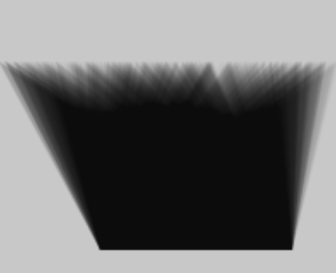

# Distribución Uniforme
1. 
``` js
function setup() {
  createCanvas(100, 100);
  background(200);
}

function draw() {
  noStroke();
  fill(0, 10);

  let x = random(100);
  let y = 50;
  //circle(x, y, 10);
  triangle(30, 75, x, 20, 86, 75);
  }
```
2. 
3. El triángulo en unos de sus vértices en x arroja valores con la misma distribución, lo que ocasiona que se forme un trapecio.
