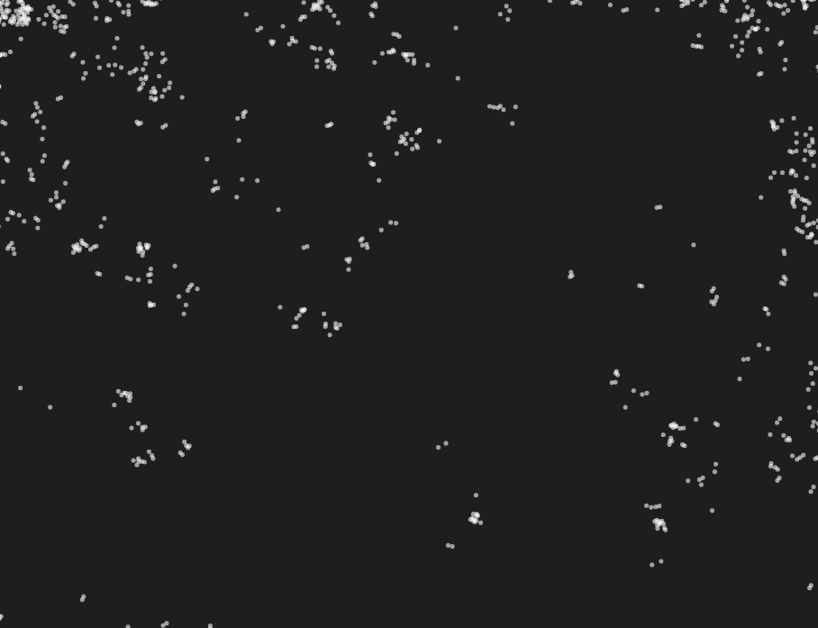

# Lévy Flight
1. Describe un tipo de movimiento aleatorio caracterizado por una combinación de pasos cortos y ocasionales saltos largos.
En una caminata de Lévy es posible observar saltos de gran magnitud con cierta frecuencia.
Los desplazamientos siguen una distribución de probabilidad de tipo potencia, lo que significa que los saltos más grandes son menos probables, pero no imposibles.
La varianza en las caminatas de Lévy es infinita debido a la probabilidad no despreciable de saltos largos.
Una manera interesante de utilizarla sería en la biología para describir movimientos de animales, microorganismos o moléculas en sistemas biológicos.
2.
``` js
let position;
let stepSize = 2;

function setup() {
  createCanvas(800, 800);
  background(30);
  position = createVector(width / 2, height / 2); // Empieza en el centro
}

function draw() {
  noStroke();
  fill(255, 150);
  ellipse(position.x, position.y, 4, 4); // Dibuja el punto actual

  let step = levyFlight();

  position.add(step);
  
  position.x = constrain(position.x, 0, width);
  position.y = constrain(position.y, 0, height);
}

function levyFlight() {
  let angle = random(TWO_PI);
  
  let step = pow(random(1), -1.5); // Colas largas
  step *= stepSize; // Escala del paso
  
  let stepX = cos(angle) * step;
  let stepY = sin(angle) * step;
  
  return createVector(stepX, stepY);
}
```
3. 

Acá podemos ver como genera un cúmulo de valores en una zona y pega un salto a otra para hacer otro grupo de valores.
