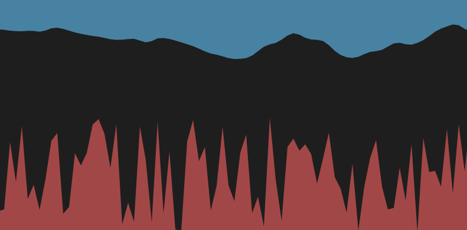

## Ruido Perlin
1. EL Ruido Perlin se caracteriza por arrojar datos que esten próximos uno al otro a diferencia del ruido aleatorio. De esta forma se genera una curva más suavizada y menos caótica.
2. En el código utilice la fórmula noise(xoff, yoff) para generar valores netre 0 y 1 para que se forme una curva suave y continua. A su vez, puse a la vez un ruido aleatorio para ver la diferencia entre las dos con la formula random(height / 2, height);
3.
``` js
let yoff = 0;

function setup() {
  createCanvas(800, 400);
  noStroke();
}

function draw() {
  background(30);

  fill(100, 200, 255, 150);
  beginShape();
  let xoff = 0;
  for (let x = 0; x <= width; x += 10) {
    let y = noise(xoff, yoff) * (height / 2);
    vertex(x, y);
    xoff += 0.05;
  }
  vertex(width, 0);
  vertex(0, 0);
  endShape(CLOSE);

  fill(255, 100, 100, 150);
  beginShape();
  for (let x = 0; x <= width; x += 10) {
    let y = random(height / 2, height);
    vertex(x, y);
  }
  vertex(width, height);
  vertex(0, height);
  endShape(CLOSE);

  yoff += 0.01;
}
```
4. 
