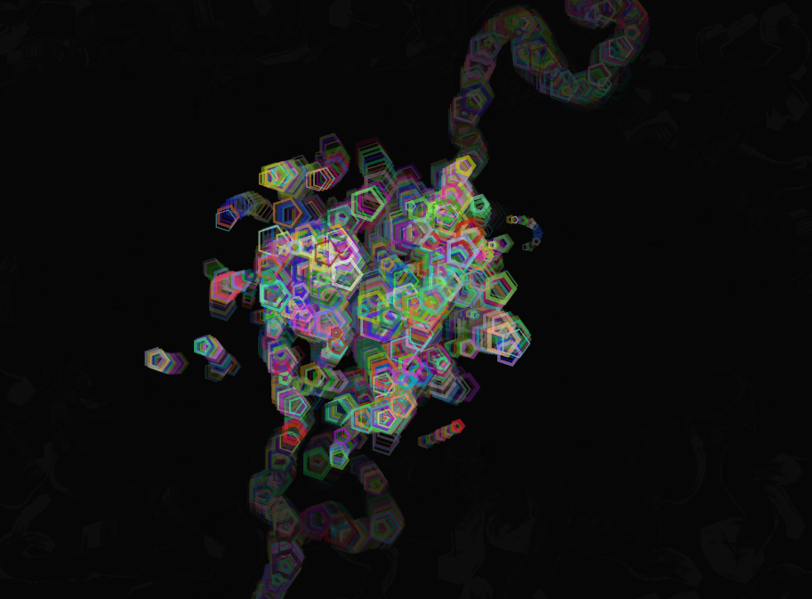

### Codigo
``` js
let particles = [];
let noiseOffset = 0;
let directionFactor = 1;

function setup() {
  createCanvas(windowWidth, windowHeight);
  for (let i = 0; i < 300; i++) { // Aumenta el número de partículas
    particles.push(new Particle(random(width), random(height)));
  }
}

function draw() {
  background(0, 20);
  for (let particle of particles) {
    particle.move();
    particle.display();
  }
}

class Particle {
  constructor(x, y) {
    this.pos = createVector(x, y);
    this.vel = createVector(0, 0);
    this.acc = createVector(0, 0);
    this.maxSpeed = random(1, 3);
    this.size = random(3, 15);
  }

  move() {
    let angle = noise(this.pos.x * 0.01, this.pos.y * 0.01, noiseOffset) * TWO_PI * 4;
    let direction = p5.Vector.fromAngle(angle).mult(directionFactor);
    this.acc.add(direction);
    
    // Aplicar Levy Flight en algunos casos
    if (random() < 0.01) {
      this.acc.mult(random(5, 10));
    }
    
    this.vel.add(this.acc);
    this.vel.limit(this.maxSpeed * directionFactor);
    this.pos.add(this.vel);
    this.acc.mult(0);

    // Rebote en los bordes
    if (this.pos.x > width || this.pos.x < 0) this.vel.x *= -1;
    if (this.pos.y > height || this.pos.y < 0) this.vel.y *= -1;
  }

  display() {
    noFill();
    stroke(random(255), random(255), random(255), 150);
    strokeWeight(random(1, 4));
    beginShape();
    for (let i = 0; i < 5; i++) { // Formas más caóticas
      let angle = TWO_PI * i / 5;
      let x = this.pos.x + cos(angle) * this.size;
      let y = this.pos.y + sin(angle) * this.size;
      vertex(x, y);
    }
    endShape(CLOSE);
  }
}

function mousePressed() {
  // Cambia la distribución de partículas
  for (let particle of particles) {
    particle.pos = createVector(randomGaussian(mouseX, 50), randomGaussian(mouseY, 50));
  }
}

function keyPressed() {
  if (keyCode === 87) { // W key
    directionFactor = 1.5; // Aumenta la velocidad de movimiento
  } else if (keyCode === 83) { // S key
    directionFactor = 0.5; // Reduce la velocidad de movimiento
  } else if (keyCode === 82) { // R key
    directionFactor = 1; // Restablece la velocidad normal
  }
}
```
### Resultado

