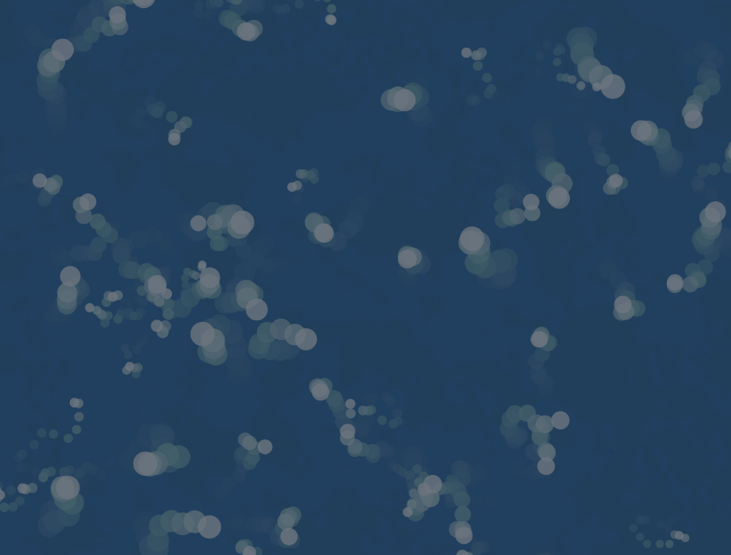

## Código
``` js
let particles = [];
let mic;

function setup() {
  createCanvas(windowWidth, windowHeight);
  mic = new p5.AudioIn();
  mic.start();
  for (let i = 0; i < 100; i++) {
    particles.push(new Particle(random(width), random(height)));
  }
}

function draw() {
  background(30, 60, 90, 50); 
  let vol = mic.getLevel() * 5; 
  vol = constrain(vol, 0, 1); 
  let forceMagnitude = map(vol, 0, 1, 0, 15); 

  for (let p of particles) {
    let soundForce = p5.Vector.random2D();
    soundForce.setMag(forceMagnitude);
    p.applyForce(soundForce);
    p.update();
    p.display(vol);
  }
}

class Particle {
  constructor(x, y) {
    this.pos = createVector(x, y);
    this.vel = p5.Vector.random2D();
    this.acc = createVector(0, 0);
    this.size = random(5, 15);
    this.originalSize = this.size;
  }

  applyForce(force) {
    this.acc.add(force);
  }

  update() {
    this.vel.add(this.acc);
    this.pos.add(this.vel);
    this.acc.mult(0);
    this.vel.limit(5);

    if (this.pos.x < 0 || this.pos.x > width) {
      this.vel.x *= -1;
    }
    if (this.pos.y < 0 || this.pos.y > height) {
      this.vel.y *= -1;
    }
  }

  display(vol) {
    let colorR = map(vol, 0, 1, 50, 180); // Verde a morado intenso
    let colorG = map(vol, 0, 1, 200, 20); // Verde fuerte a débil
    let colorB = map(vol, 0, 1, 50, 220); // Azul a más fuerte (morados)
    fill(colorR, colorG, colorB, 200);
    noStroke();
    
    let scaredSize = map(vol, 0, 1, this.originalSize, this.originalSize * 2.5);
    ellipse(this.pos.x, this.pos.y, scaredSize);

    if (vol > 0.2) {
      this.vel.add(p5.Vector.random2D().mult(5));
    } else {
      this.vel.mult(0.9); // Suaviza el movimiento cuando el volumen baja
    }
  }
}
```
## Resultado

