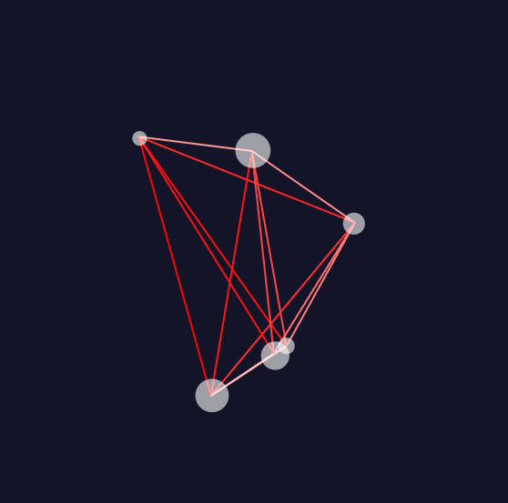

## Simulación de N-Cuerpos y el Hilo Rojo del Destino
### Propósito de la Simulación
Esta simulación representa la creencia de que las almas gemelas están unidas por un hilo rojo del destino, un lazo invisible pero irrompible que conecta a dos personas destinadas a encontrarse. Sin embargo, en esta versión, el color del hilo cambia según la distancia, simbolizando la cercanía o lejanía del encuentro entre las almas. Cuando los cuerpos están cerca, el hilo brilla en un rojo intenso; a medida que se alejan, el color se atenúa hacia el naranja y el blanco, reflejando el tiempo y los caminos que aún deben recorrer para encontrarse.

Más allá de la metáfora romántica, esta simulación es una representación visual del problema de los n-cuerpos, un fenómeno físico donde múltiples objetos ejercen fuerzas gravitacionales entre sí, generando trayectorias dinámicas e impredecibles.
``` js
let bodies = [];
const G = 1; // Constante gravitacional arbitraria

function setup() {
  createCanvas(600, 600);
  
  for (let i = 0; i < 6; i++) {
    let x = random(width / 3, (2 * width) / 3);
    let y = random(height / 3, (2 * height) / 3);
    let mass = random(5, 20);
    bodies.push(new Body(x, y, mass));
  }
}

function draw() {
  background(20, 20, 40);
  
  // Aplicar fuerzas gravitacionales entre los cuerpos
  for (let i = 0; i < bodies.length; i++) {
    for (let j = i + 1; j < bodies.length; j++) {
      let force = bodies[i].calculateAttraction(bodies[j]);
      bodies[i].applyForce(force);
      bodies[j].applyForce(force.mult(-1));
    }
  }

  // Dibujar las conexiones con color basado en la distancia
  for (let i = 0; i < bodies.length; i++) {
    for (let j = i + 1; j < bodies.length; j++) {
      let d = dist(bodies[i].position.x, bodies[i].position.y, bodies[j].position.x, bodies[j].position.y);
      let colorFactor = map(d, 5, width / 2, 255, 0); // Más distancia, menos rojo
      
      stroke(255, colorFactor, colorFactor); // Rojo->Naranja->Blanco
      strokeWeight(2);
      line(bodies[i].position.x, bodies[i].position.y, bodies[j].position.x, bodies[j].position.y);
    }
  }

  // Actualizar y dibujar los cuerpos
  for (let body of bodies) {
    body.update();
    body.checkEdges();
    body.display();
  }
}

class Body {
  constructor(x, y, mass) {
    this.position = createVector(x, y);
    this.velocity = p5.Vector.random2D().mult(random(1, 3));
    this.acceleration = createVector(0, 0);
    this.mass = mass;
  }

  applyForce(force) {
    let f = p5.Vector.div(force, this.mass);
    this.acceleration.add(f);
  }

  calculateAttraction(other) {
    let force = p5.Vector.sub(other.position, this.position);
    let distance = constrain(force.mag(), 5, 50);
    let strength = (G * this.mass * other.mass) / (distance * distance);
    force.setMag(strength);
    return force;
  }

  update() {
    this.velocity.add(this.acceleration);
    this.position.add(this.velocity);
    this.acceleration.mult(0);
  }

  checkEdges() {
    if (this.position.x < 0 || this.position.x > width) {
      this.velocity.x *= -1;
      this.position.x = constrain(this.position.x, 0, width);
    }
    if (this.position.y < 0 || this.position.y > height) {
      this.velocity.y *= -1;
      this.position.y = constrain(this.position.y, 0, height);
    }
  }

  display() {
    fill(255, 150);
    noStroke();
    ellipse(this.position.x, this.position.y, this.mass * 2);
  }
}
```

https://editor.p5js.org/carlossanta16/sketches/epwXjWh_P

### Modelado de los cuerpos

1. Cada cuerpo tiene una posición, velocidad, aceleración y masa.
Se inicializan con posiciones aleatorias y velocidades aleatorias.

2. Interacción gravitacional

Se usa la fórmula de la gravitación universal de Newton:
𝐹=(𝐺⋅𝑚1⋅𝑚2)/𝑑2

* G es una constante arbitraria, y m1 y m2 son las masas de los cuerpos, y d es la distancia entre ellos.
Cada cuerpo atrae a los demás y sus trayectorias cambian en consecuencia.

3. Cambio de color del hilo según la distancia

Se dibujan líneas entre cada par de cuerpos para simbolizar el hilo rojo del destino.
La intensidad del rojo se calcula con map(), reduciéndose conforme aumenta la distancia.
Si los cuerpos están cerca, el hilo es rojo intenso; si están muy lejos, el hilo se vuelve naranja o blanco.

4. Restricción de los límites de la pantalla

Se implementa una función para evitar que los cuerpos salgan de los bordes, haciéndolos rebotar con una inversión de velocidad al colisionar con los límites.



https://editor.p5js.org/carlossanta16/sketches/epwXjWh_P

### Reflexión y Significado
Esta simulación mezcla física, arte y filosofía. No es solo una representación de la gravedad y las fuerzas en un sistema dinámico, sino también una exploración visual de cómo las conexiones entre individuos pueden cambiar con el tiempo y la distancia.

En términos de jugabilidad o narrativa, esta idea podría expandirse en un juego interactivo o experiencia visual, donde los usuarios podrían influir en las fuerzas o ver cómo el destino une o separa a los cuerpos en el universo.
