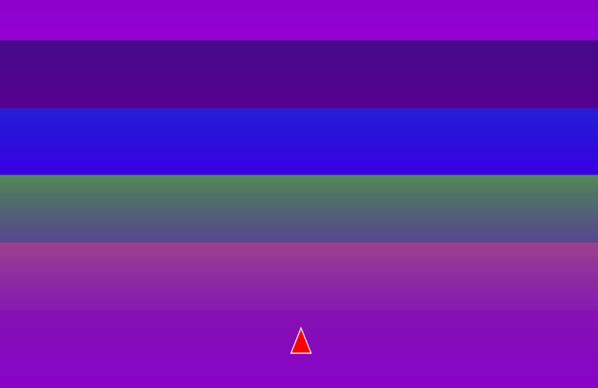

## Rainbow Road
https://editor.p5js.org/carlossanta16/sketches/PjPlyBB-3
``` js
let car;
let t = 0;

function setup() {
  createCanvas(600, 400);
  car = new Car();
}

function draw() {
  drawRainbowBackground();
  car.update();
  car.show();
}

function drawRainbowBackground() {
  for (let i = 0; i < height; i++) {
    let inter = map(i, 0, height, 0, 1);
    let c = lerpColor(color(255, 0, 0), color(255, 165, 0), (inter + t) % 1);
    c = lerpColor(c, color(255, 255, 0), (inter + t + 0.166) % 1);
    c = lerpColor(c, color(0, 255, 0), (inter + t + 0.333) % 1);
    c = lerpColor(c, color(0, 0, 255), (inter + t + 0.5) % 1);
    c = lerpColor(c, color(75, 0, 130), (inter + t + 0.666) % 1);
    c = lerpColor(c, color(148, 0, 211), (inter + t + 0.833) % 1);
    stroke(c);
    line(0, i, width, i);
  }
  t += 0.01;
}

class Car {
  constructor() {
    this.x = width / 2;
    this.y = height - 50;
    this.angle = 0;
    this.speed = 0;
  }

  update() {
    this.x += this.speed;
    this.x = constrain(this.x, 20, width - 20);
    if (this.speed !== 0) {
      this.angle = atan2(this.speed, 5);
    }
  }

  show() {
    push();
    translate(this.x, this.y);
    rotate(this.angle);
    fill(255, 0, 0);
    stroke(255);
    triangle(-10, 10, 10, 10, 0, -15);
    pop();
  }
}

function keyPressed() {
  if (keyCode === LEFT_ARROW) {
    car.speed = -2;
  } else if (keyCode === RIGHT_ARROW) {
    car.speed = 2;
  }
}

function keyReleased() {
  if (keyCode === LEFT_ARROW || keyCode === RIGHT_ARROW) {
    car.speed = 0;
  }
}
```

