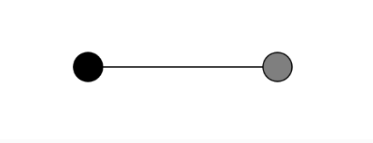

``` js
let period = 120;
let amplitude = 200;
let phase = 0;
let omega;
let t = 0;

function setup() {
  createCanvas(640, 240);
  updateOmega(); // Inicializamos omega correctamente
}

function draw() {
  background(255);
  
  let x = amplitude * sin(omega * t);
  let x2 = amplitude * sin(omega * t + phase);

  stroke(0);
  strokeWeight(2);
  translate(width / 2, height / 2);

  fill(127);
  line(0, 0, x, 0);
  circle(x, 0, 48);
  
  fill(0);
  line(0, 0, x2, 0);
  circle(x2, 0, 48);  
  
  t++;
}

function keyPressed() {
  if (key === 'A' || key === 'a') amplitude += 20;
  if (key === 'Z' || key === 'z') amplitude = max(20, amplitude - 20);
  if (key === 'S' || key === 's') {
    period += 20;
    updateOmega();
  }
  if (key === 'X' || key === 'x') {
    period = max(20, period - 20);
    updateOmega();
  }
  if (key === 'D' || key === 'd') phase += TWO_PI / 18; // Aumenta más rápido
  if (key === 'C' || key === 'c') phase -= TWO_PI / 18;
}

function updateOmega() {
  omega = TWO_PI / period;
}
```

https://editor.p5js.org/carlossanta16/sketches/jJtQWTW2Y

 Controles:

* A → Aumenta la amplitud (el tamaño del movimiento de la onda).
* Z → Disminuye la amplitud, pero nunca bajará de 20.
* S → Aumenta el periodo (la onda se mueve más lentamente).
* X → Disminuye el periodo, haciendo que la onda sea más rápida.
* D → Aumenta la fase (desplaza la onda hacia adelante).
* C → Disminuye la fase (desplaza la onda hacia atrás).


