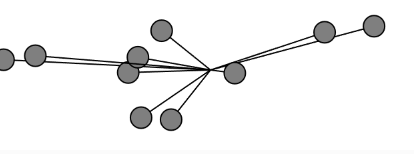

``` js
let system;

function setup() {
  createCanvas(640, 240);
  system = new OscillatorSystem(10);
}

function draw() {
  background(255);
  let wind = createVector(0.001 * sin(frameCount * 0.01), 0);
  system.applyForce(wind);
  system.update();
  system.show();
}

class OscillatorSystem {
  constructor(num) {
    this.oscillators = [];
    for (let i = 0; i < num; i++) {
      let osc = {
        angle: createVector(),
        angleVelocity: createVector(random(-0.05, 0.05), random(-0.05, 0.05)),
        amplitude: createVector(random(20, width / 2), random(20, height / 2)),
        acceleration: createVector(0, 0)
      };
      this.oscillators.push(osc);
    }
  }

  applyForce(force) {
    for (let i = 0; i < this.oscillators.length; i++) {
      this.oscillators[i].acceleration.add(force);
    }
  }

  update() {
    for (let i = 0; i < this.oscillators.length; i++) {
      let osc = this.oscillators[i];
      let randomFactor = p5.Vector.random2D().mult(0.01);
      osc.angleVelocity.add(randomFactor);
      osc.angleVelocity.add(osc.acceleration);
      osc.angle.add(osc.angleVelocity);
      osc.angleVelocity.limit(0.1);
      osc.acceleration.mult(0);
    }
  }

  show() {
    push();
    translate(width / 2, height / 2);
    for (let i = 0; i < this.oscillators.length; i++) {
      let osc = this.oscillators[i];
      let x = sin(osc.angle.x) * osc.amplitude.x;
      let y = sin(osc.angle.y) * osc.amplitude.y;
      stroke(0);
      strokeWeight(2);
      fill(127);
      line(0, 0, x, y);
      circle(x, y, 32);
    }
    pop();
  }
}
```

https://editor.p5js.org/carlossanta16/sketches/jJtQWTW2Y

Es super caotico jajaja


