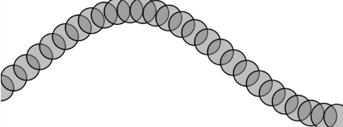

``` js
let angle = 0;
let angleVelocity = 0.2;
let amplitude = 100;
let waveOffset = 0; // Desplazamiento de la ola

function setup() {
  createCanvas(640, 240);
}

function draw() {
  background(255);

  stroke(0);
  strokeWeight(2);
  fill(127, 127);

  let tempAngle = angle + waveOffset; // Se mueve con el tiempo

  for (let x = 0; x <= width; x += 24) {
    let y = amplitude * sin(tempAngle);
    circle(x, y + height / 2, 48);
    tempAngle += angleVelocity;
  }

  waveOffset += 0.05; // Hace que la onda avance como una ola
}
```
* Para hacer que la onda se mueva como una ola, necesitamos animarla en draw() en lugar de setup(), agregando un desplazamiento global al ángulo en cada frame.

https://editor.p5js.org/carlossanta16/sketches/UB-44wFib


