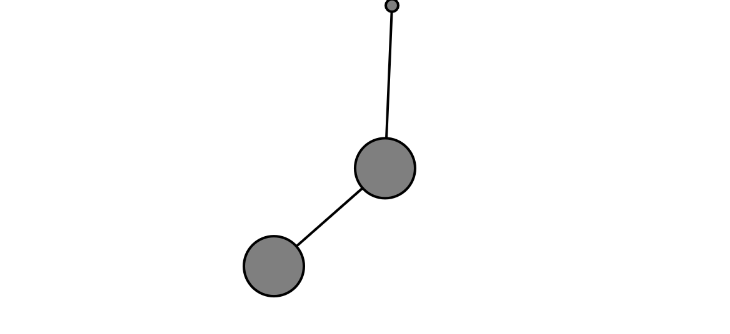

## Resortes
https://editor.p5js.org/carlossanta16/sketches/9ReZ8MiNd

``` js
class Bob {
  constructor(x, y) {
    this.position = createVector(x, y);
    this.velocity = createVector();
    this.acceleration = createVector();
    this.mass = 24;
    this.damping = 0.98;
    this.dragOffset = createVector();
    this.dragging = false;
  }

  update() {
    this.velocity.add(this.acceleration);
    this.velocity.mult(this.damping);
    this.position.add(this.velocity);
    this.acceleration.mult(0);
  }

  applyForce(force) {
    let f = force.copy();
    f.div(this.mass);
    this.acceleration.add(f);
  }

  show() {
    stroke(0);
    strokeWeight(2);
    fill(this.dragging ? 200 : 127);
    circle(this.position.x, this.position.y, this.mass * 2);
  }

  handleClick(mx, my) {
    let d = dist(mx, my, this.position.x, this.position.y);
    if (d < this.mass) {
      this.dragging = true;
      this.dragOffset.set(this.position.x - mx, this.position.y - my);
    }
  }

  stopDragging() {
    this.dragging = false;
  }

  handleDrag(mx, my) {
    if (this.dragging) {
      this.position.set(mx + this.dragOffset.x, my + this.dragOffset.y);
    }
  }
}

class Spring {
  constructor(x, y, length) {
    this.anchor = createVector(x, y);
    this.restLength = length;
    this.k = 0.2;
  }

  connect(bob) {
    let force = p5.Vector.sub(bob.position, this.anchor);
    let stretch = force.mag() - this.restLength;
    force.setMag(-this.k * stretch);
    bob.applyForce(force);
  }

  constrainLength(bob, minlen, maxlen) {
    let direction = p5.Vector.sub(bob.position, this.anchor);
    let length = direction.mag();
    if (length < minlen || length > maxlen) {
      direction.setMag(constrain(length, minlen, maxlen));
      bob.position = p5.Vector.add(this.anchor, direction);
      bob.velocity.mult(0);
    }
  }

  showLine(bob) {
    stroke(0);
    line(bob.position.x, bob.position.y, this.anchor.x, this.anchor.y);
  }

  show() {
    fill(127);
    circle(this.anchor.x, this.anchor.y, 10);
  }
}

let bob1, bob2, spring1, spring2;

function setup() {
  createCanvas(640, 400);
  spring1 = new Spring(width / 2, 10, 100);
  bob1 = new Bob(width / 2, 120);
  spring2 = new Spring(bob1.position.x, bob1.position.y, 100);
  bob2 = new Bob(width / 2, 220);
}

function draw() {
  background(255);
  
  let gravity = createVector(0, 2);
  bob1.applyForce(gravity);
  bob2.applyForce(gravity);

  bob1.update();
  bob2.update();
  
  bob1.handleDrag(mouseX, mouseY);
  bob2.handleDrag(mouseX, mouseY);
  
  spring1.connect(bob1);
  spring2.anchor = bob1.position;
  spring2.connect(bob2);

  spring1.constrainLength(bob1, 30, 200);
  spring2.constrainLength(bob2, 30, 200);
  
  spring1.showLine(bob1);
  spring2.showLine(bob2);
  
  bob1.show();
  bob2.show();
  spring1.show();
}

function mousePressed() {
  bob1.handleClick(mouseX, mouseY);
  bob2.handleClick(mouseX, mouseY);
}

function mouseReleased() {
  bob1.stopDragging();
  bob2.stopDragging();
}
```

