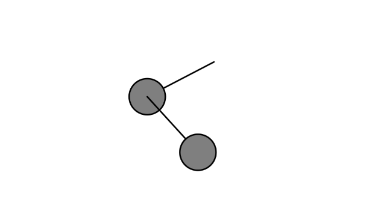

## Pendulum

https://editor.p5js.org/carlossanta16/sketches/9ReZ8MiNd

``` js
// Simulación de dos péndulos conectados en serie

class Pendulum {
  constructor(x, y, r, parent = null) {
    this.pivot = createVector(x, y);
    this.bob = createVector();
    this.r = r;
    this.angle = PI / 4;
    this.angleVelocity = 0.0;
    this.angleAcceleration = 0.0;
    this.damping = 0.995; 
    this.ballr = 24.0;
    this.parent = parent;
    this.dragging = false;
  }

  update() {
    if (!this.dragging) {
      let gravity = 0.4;
      this.angleAcceleration = ((-1 * gravity) / this.r) * sin(this.angle);
      this.angleVelocity += this.angleAcceleration;
      this.angle += this.angleVelocity;
      this.angleVelocity *= this.damping;
    }

    this.bob.set(this.r * sin(this.angle), this.r * cos(this.angle), 0);
    if (this.parent) {
      this.pivot.set(this.parent.bob.x, this.parent.bob.y);
    }
    this.bob.add(this.pivot);
  }

  show() {
    stroke(0);
    strokeWeight(2);
    line(this.pivot.x, this.pivot.y, this.bob.x, this.bob.y);
    fill(127);
    circle(this.bob.x, this.bob.y, this.ballr * 2);
  }

  clicked(mx, my) {
    let d = dist(mx, my, this.bob.x, this.bob.y);
    if (d < this.ballr) {
      this.dragging = true;
    }
  }

  stopDragging() {
    this.angleVelocity = 0;
    this.dragging = false;
  }

  drag() {
    if (this.dragging) {
      let diff = p5.Vector.sub(this.pivot, createVector(mouseX, mouseY));
      this.angle = atan2(-1 * diff.y, diff.x) - radians(90);
    }
  }
}

let pendulum1;
let pendulum2;

function setup() {
  createCanvas(640, 480);
  pendulum1 = new Pendulum(width / 2, 100, 100);
  pendulum2 = new Pendulum(0, 0, 100, pendulum1);
}

function draw() {
  background(255);
  pendulum1.update();
  pendulum2.update();
  pendulum1.show();
  pendulum2.show();
  pendulum1.drag();
  pendulum2.drag();
}

function mousePressed() {
  pendulum1.clicked(mouseX, mouseY);
  pendulum2.clicked(mouseX, mouseY);
}

function mouseReleased() {
  pendulum1.stopDragging();
  pendulum2.stopDragging();
}
```


