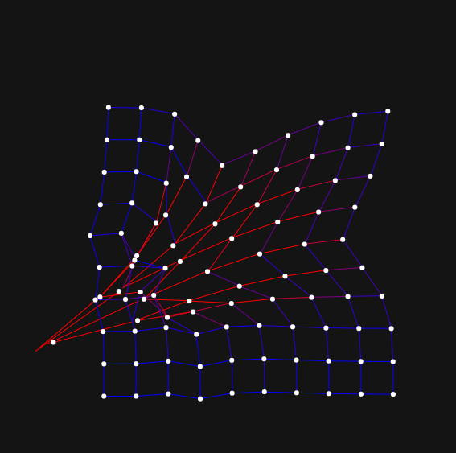

## Entrega
``` js
let cols = 10, rows = 10;
let spacing = 40;
let points = [];
let springs = [];
let draggedPoint = null;

function setup() {
  createCanvas(600, 600);
  for (let y = 0; y < rows; y++) {
    for (let x = 0; x < cols; x++) {
      let px = x * spacing + width / 4;
      let py = y * spacing + height / 4;
      points.push(new Point(px, py));
    }
  }
  for (let y = 0; y < rows; y++) {
    for (let x = 0; x < cols; x++) {
      let index = x + y * cols;
      if (x < cols - 1) springs.push(new Spring(points[index], points[index + 1]));
      if (y < rows - 1) springs.push(new Spring(points[index], points[index + cols]));
    }
  }
}

function draw() {
  background(20);
  for (let spring of springs) {
    spring.update();
    spring.show();
  }
  for (let point of points) {
    point.show();
  }
}

function mousePressed() {
  for (let point of points) {
    if (dist(mouseX, mouseY, point.x, point.y) < 10) {
      draggedPoint = point;
      break;
    }
  }
}

function mouseDragged() {
  if (draggedPoint) {
    draggedPoint.x = mouseX;
    draggedPoint.y = mouseY;
  }
}

function mouseReleased() {
  draggedPoint = null;
}

class Point {
  constructor(x, y) {
    this.x = x;
    this.y = y;
    this.ox = x;
    this.oy = y;
  }
  show() {
    fill(255);
    noStroke();
    ellipse(this.x, this.y, 6);
  }
}

class Spring {
  constructor(p1, p2) {
    this.p1 = p1;
    this.p2 = p2;
    this.length = dist(p1.x, p1.y, p2.x, p2.y);
  }
  update() {
    let dx = this.p2.x - this.p1.x;
    let dy = this.p2.y - this.p1.y;
    let d = dist(this.p1.x, this.p1.y, this.p2.x, this.p2.y);
    let diff = this.length - d;
    let forceX = (dx / d) * diff * 0.1;
    let forceY = (dy / d) * diff * 0.1;
    this.p1.x -= forceX;
    this.p1.y -= forceY;
    this.p2.x += forceX;
    this.p2.y += forceY;
  }
  show() {
    stroke(lerpColor(color(0, 0, 255), color(255, 0, 0), abs(this.length - dist(this.p1.x, this.p1.y, this.p2.x, this.p2.y)) * 0.1));
    line(this.p1.x, this.p1.y, this.p2.x, this.p2.y);
  }
}
```


https://editor.p5js.org/carlossanta16/sketches/t4BPRAavx
