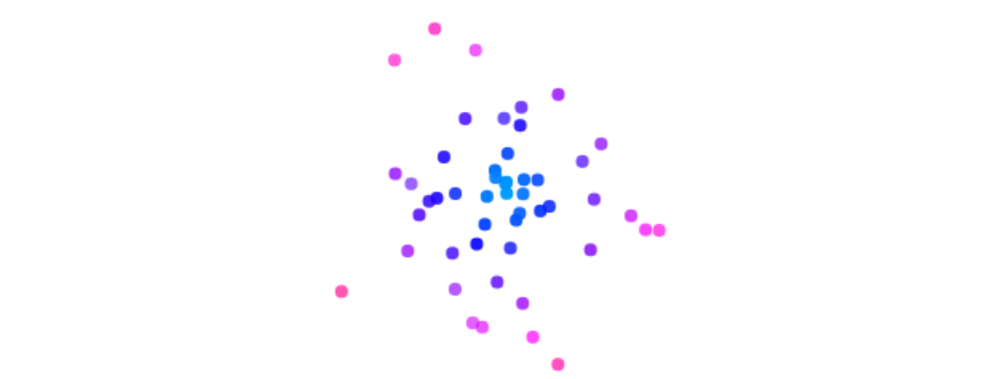
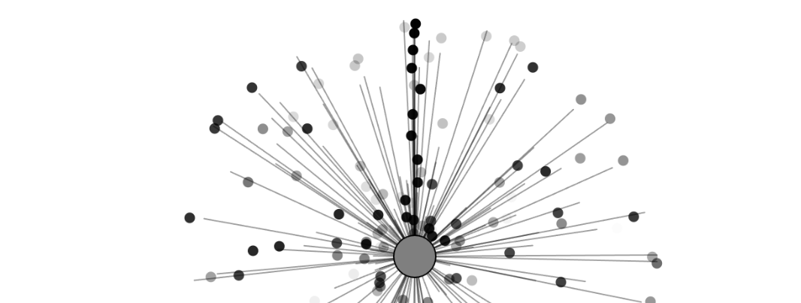

### Ruido Perlin en Ej. 4.2

``` js
let particles = [];
let noiseOffset = 0;

function setup() {
  createCanvas(640, 240);
}

function draw() {
  background(255);
  particles.push(new Particle(width / 2, 20));

  for (let i = particles.length - 1; i >= 0; i--) {
    let particle = particles[i];
    particle.run();
    if (particle.isDead()) {
      particles.splice(i, 1);
    }
  }
}

class Particle {
  constructor(x, y) {
    this.pos = createVector(x, y);
    this.lifespan = 255;
    this.xoff = random(1000);
    this.yoff = random(1000);
  }

  run() {
    this.update();
    this.display();
  }

  update() {
    this.pos.x += map(noise(this.xoff), 0, 1, -2, 2);
    this.pos.y += map(noise(this.yoff), 0, 1, -2, 2);

    this.xoff += 0.01;
    this.yoff += 0.01;

    this.lifespan -= 2;
  }

  display() {
    noStroke();
    fill(0, this.lifespan);
    ellipse(this.pos.x, this.pos.y, 8);
  }

  isDead() {
    return this.lifespan <= 0;
  }
}
```

https://editor.p5js.org/carlossanta16/sketches/ZIPRLv-PF


### Interpolación en Ej. 4.4

``` js
let emitter;

function setup() {
  createCanvas(640, 240);
  colorMode(HSB, 360, 100, 100, 255); // Enable HSB for easy hue shifting
  emitter = new Emitter(width / 2, 120); // center vertically
}

function draw() {
  background(0, 0, 100); // white background in HSB
  emitter.addParticle();  
  emitter.run();
}

class Emitter {
  constructor(x, y) {
    this.origin = createVector(x, y);
    this.particles = [];
  }

  addParticle() {
    this.particles.push(new Particle(this.origin.x, this.origin.y, this.origin));
  }

  run() {
    for (let i = this.particles.length - 1; i >= 0; i--) {
      let p = this.particles[i];
      p.run();
      if (p.isDead()) {
        this.particles.splice(i, 1);
      }
    }
  }
}

class Particle {
  constructor(x, y, origin) {
    this.startPos = createVector(x, y);
    this.targetPos = p5.Vector.random2D().mult(random(50, 150)).add(x, y);
    this.pos = this.startPos.copy();
    this.origin = origin.copy(); // reference point for distance
    this.lifespan = 255;
    this.t = 0;
  }

  run() {
    this.update();
    this.display();
  }

  update() {
    this.t += 0.02;
    this.pos = p5.Vector.lerp(this.startPos, this.targetPos, this.t);
    this.lifespan -= 2;
  }

  display() {
    let d = dist(this.origin.x, this.origin.y, this.pos.x, this.pos.y);
    let maxDist = 150;
    let hue = map(d, 0, maxDist, 200, 360); // Blue to red range
    let sat = 100;
    let bright = 100;

    noStroke();
    fill(hue, sat, bright, this.lifespan);
    ellipse(this.pos.x, this.pos.y, 8);
  }

  isDead() {
    return this.lifespan <= 0 || this.t >= 1;
  }
}
```

https://editor.p5js.org/carlossanta16/sketches/7Q4lbUFXp



### Fuerza Gravitacional en Ej. 4.5

``` js
let emitter;
let planetPos;

function setup() {
  createCanvas(640, 240);
  colorMode(HSB, 360, 100, 100, 255);
  emitter = new Emitter(width / 2, 20);
  planetPos = createVector(width / 2, height / 2 + 50); // The "planet"
}

function draw() {
  background(0, 0, 100); // white background

  // Draw the planet
  noStroke();
  fill(210, 80, 80);
  ellipse(planetPos.x, planetPos.y, 30);

  emitter.addParticle();
  emitter.run();
}

// ───────────── EMITTER CLASS ─────────────
class Emitter {
  constructor(x, y) {
    this.origin = createVector(x, y);
    this.particles = [];
  }

  addParticle() {
    let r = random(1);
    if (r < 0.5) {
      this.particles.push(new Particle(this.origin.x, this.origin.y));
    } else {
      this.particles.push(new Confetti(this.origin.x, this.origin.y));
    }
  }

  run() {
    for (let i = this.particles.length - 1; i >= 0; i--) {
      let particle = this.particles[i];
      particle.run();
      if (particle.isDead()) {
        this.particles.splice(i, 1);
      }
    }
  }
}

// ───────────── PARTICLE BASE CLASS ─────────────
class Particle {
  constructor(x, y) {
    this.pos = createVector(x, y);
    this.vel = p5.Vector.random2D().mult(random(1, 2));
    this.acc = createVector(0, 0);
    this.lifespan = 255;
  }

  applyForce(force) {
    this.acc.add(force);
  }

  attractTo(target) {
    let force = p5.Vector.sub(target, this.pos);
    let distance = constrain(force.mag(), 5, 100);

    // 💥 STRONGER gravity
    let strength = 300 / (distance * distance);
    force.setMag(strength);

    this.applyForce(force);
  }

  run() {
    this.attractTo(planetPos); // ← Gravity toward planet
    this.update();
    this.display();
  }

  update() {
    this.vel.add(this.acc);
    this.pos.add(this.vel);
    this.acc.mult(0);
    this.lifespan -= 2;
  }

  display() {
    noStroke();
    fill(0, 0, 0, this.lifespan);
    ellipse(this.pos.x, this.pos.y, 8);
  }

  isDead() {
    return this.lifespan <= 0;
  }
}

// ───────────── CONFETTI EXTENDING PARTICLE ─────────────
class Confetti extends Particle {
  display() {
    rectMode(CENTER);
    noStroke();
    fill(300, 80, 80, this.lifespan);
    rect(this.pos.x, this.pos.y, 8, 8);
  }
}
```

https://editor.p5js.org/carlossanta16/sketches/t4BPRAavx


### Resistencia de aire y bounce en Ej. 4.6

``` js
let emitter;

function setup() {
  createCanvas(640, 240);
  emitter = new Emitter(createVector(width / 2, 20));
}

function draw() {
  background(255);

  // Apply gravity to all particles
  let gravity = createVector(0, 0.2);
  emitter.applyForce(gravity);

  emitter.addParticle();
  emitter.run();
}

// ───────────── EMITTER CLASS ─────────────
class Emitter {
  constructor(position) {
    this.origin = position.copy();
    this.particles = [];
  }

  addParticle() {
    this.particles.push(new Particle(this.origin.x, this.origin.y));
  }

  applyForce(force) {
    for (let particle of this.particles) {
      particle.applyForce(force);
    }
  }

  run() {
    for (let i = this.particles.length - 1; i >= 0; i--) {
      let particle = this.particles[i];
      particle.run();
      if (particle.isDead()) {
        this.particles.splice(i, 1);
      }
    }
  }
}

// ───────────── PARTICLE CLASS ─────────────
class Particle {
  constructor(x, y) {
    this.pos = createVector(x, y);
    this.vel = createVector(random(-1, 1), random(-1, 0));
    this.acc = createVector(0, 0);
    this.lifespan = 255;
  }

  applyForce(force) {
    this.acc.add(force);
  }

  update() {
    // Apply air resistance (drag)
    let drag = this.vel.copy();
    drag.mult(-1);
    drag.normalize();
    let speedSq = this.vel.magSq();
    let dragCoefficient = 0.01;
    drag.mult(dragCoefficient * speedSq);
    this.applyForce(drag);

    // Physics
    this.vel.add(this.acc);
    this.pos.add(this.vel);
    this.acc.mult(0);

    // Bounce if it hits the bottom
    if (this.pos.y >= height) {
      this.pos.y = height;
      this.vel.y *= -0.8; // bounce upward
      this.lifespan -= 20; // fade more on bounce
    }

    this.lifespan -= 2;
  }

  display() {
    noStroke();
    fill(0, this.lifespan);
    ellipse(this.pos.x, this.pos.y, 10);
  }

  run() {
    this.update();
    this.display();
  }

  isDead() {
    return this.lifespan <= 0;
  }
}
```

https://editor.p5js.org/carlossanta16/sketches/E4gDCCl63


### Pendulo y Resorte en Ej. 4.7

``` js
let emitter;
let repeller;

function setup() {
  createCanvas(640, 240);
  emitter = new Emitter(width / 2, 20);
  repeller = new Repeller(width / 2, 200);
}

function draw() {
  background(255);

  emitter.addParticle();

  let gravity = createVector(0, 0.1);
  emitter.applyForce(gravity);

  emitter.applySpring(repeller); // <-- New springy force
  emitter.run();

  repeller.show();
}

// ─────────── Emitter ───────────
class Emitter {
  constructor(x, y) {
    this.origin = createVector(x, y);
    this.particles = [];
  }

  addParticle() {
    this.particles.push(new Particle(this.origin.x, this.origin.y));
  }

  applyForce(force) {
    for (let particle of this.particles) {
      particle.applyForce(force);
    }
  }

  applySpring(anchor) {
    for (let particle of this.particles) {
      let springForce = this.springForce(anchor.position, particle.position, 0.05, 100);
      particle.applyForce(springForce);

      // Draw the spring
      stroke(0, 100);
      line(particle.position.x, particle.position.y, anchor.position.x, anchor.position.y);
    }
  }

  springForce(anchor, position, k, restLength) {
    let force = p5.Vector.sub(position, anchor);
    let x = force.mag() - restLength;
    force.normalize();
    force.mult(-1 * k * x);
    return force;
  }

  run() {
    for (let i = this.particles.length - 1; i >= 0; i--) {
      let particle = this.particles[i];
      particle.run();
      if (particle.isDead()) {
        this.particles.splice(i, 1);
      }
    }
  }
}

// ─────────── Repeller ───────────
class Repeller {
  constructor(x, y) {
    this.position = createVector(x, y);
    this.power = 150;
  }

  show() {
    stroke(0);
    fill(127);
    circle(this.position.x, this.position.y, 32);
  }
}

// ─────────── Particle ───────────
class Particle {
  constructor(x, y) {
    this.position = createVector(x, y);
    this.velocity = createVector(random(-1, 1), random(-1, 0));
    this.acceleration = createVector(0, 0);
    this.lifespan = 255;
  }

  applyForce(force) {
    this.acceleration.add(force);
  }

  update() {
    this.velocity.add(this.acceleration);
    this.position.add(this.velocity);
    this.acceleration.mult(0);
    this.lifespan -= 2;
  }

  display() {
    noStroke();
    fill(0, this.lifespan);
    ellipse(this.position.x, this.position.y, 8);
  }

  run() {
    this.update();
    this.display();
  }

  isDead() {
    return this.lifespan < 0;
  }
}
```

https://editor.p5js.org/carlossanta16/sketches/3d3ndD6Z5



## Explicación

1. Creación:

En cada cuadro (draw()), se llama a emitter.addParticle() para crear una nueva partícula en la posición del emisor.

Las partículas se almacenan en un array llamado this.particles dentro del objeto Emitter.

2. Desaparición:

Cada partícula tiene una propiedad llamada lifespan, que va disminuyendo con el tiempo en el método update().

Cuando lifespan llega a cero, la partícula se considera "muerta".

En el método run() del emisor, se recorre el array de atrás hacia adelante (for (let i = this.particles.length - 1; i >= 0; i--)) y se elimina con .splice(i, 1) si particle.isDead() devuelve true.

* Esto es fundamental para:

Liberar memoria de las partículas que ya no se usan.

Evitar que el array crezca indefinidamente, lo cual puede hacer que el programa se vuelva lento o se trabe.

