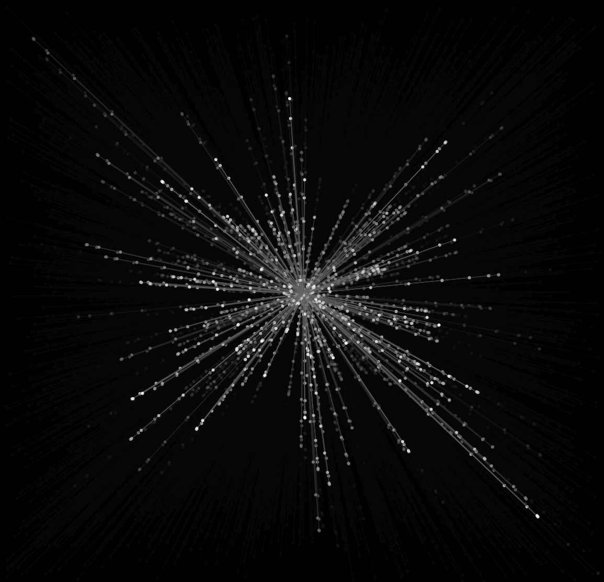

## Proyecto
### Idea

Una obra interactiva en la que partículas (tipo luciérnagas) flotan en un entorno oscuro. Las partículas están unidas a puntos mediante resortes, se mueven suavemente con ruido Perlin, responden a la gravedad, tienen interpolación para moverse hacia el cursor, y rebotan con resistencia al aire. 
La interacción será con el mouse y el micrófono: el mouse atrae y mueve las partículas; el micrófono las mueve si detecta un volumen alto.

## Clases

Sketch

``` js
let particles = [];
let mic;

function setup() {
  createCanvas(windowWidth, windowHeight);
  mic = new p5.AudioIn();
  mic.start();
}

function draw() {
  background(0, 20); // efecto de estela

  applyMicExplosion();

  for (let i = particles.length - 1; i >= 0; i--) {
    let p = particles[i];
    p.update();
    p.display();

    if (p.isDead()) {
      particles.splice(i, 1);
    }
  }

  if (particles.length < 100) {
    let anchor = createVector(width / 2, height / 2);
    particles.push(new SpringParticle(random(width), random(height), anchor));
  }
}

function applyMicExplosion() {
  let vol = mic.getLevel();
  if (vol > 0.2) {
    for (let p of particles) {
      let force = p5.Vector.random2D().mult(random(2, 5));
      p.applyForce(force);
    }
  }
}
```

Particle

``` js
class Particle {
  constructor(x, y) {
    this.pos = createVector(x, y);
    this.vel = p5.Vector.random2D();
    this.acc = createVector(0, 0);
    this.lifespan = 255;
  }

  applyForce(force) {
    this.acc.add(force);
  }

  update() {
    this.vel.mult(0.98); // resistencia del aire
    this.vel.add(this.acc);
    this.pos.add(this.vel);
    this.acc.mult(0);
    this.lifespan -= 1;
  }

  display() {
    noStroke();
    fill(255, this.lifespan);
    ellipse(this.pos.x, this.pos.y, 5);
  }

  isDead() {
    return this.lifespan <= 0;
  }
}
```

SpringParticle

``` js
class SpringParticle extends Particle {
  constructor(x, y, anchor) {
    super(x, y);
    this.anchor = anchor.copy();
    this.k = 0.05; // constante de resorte
  }

  update() {
    let springForce = p5.Vector.sub(this.anchor, this.pos);
    let d = springForce.mag();
    springForce.normalize();
    springForce.mult(this.k * d);
    this.applyForce(springForce);

    // Gravedad opcional
    this.applyForce(createVector(0, 0.05));

    super.update();
  }

  display() {
    stroke(100, this.lifespan);
    line(this.pos.x, this.pos.y, this.anchor.x, this.anchor.y);
    fill(255, this.lifespan);
    noStroke();
    ellipse(this.pos.x, this.pos.y, 6);
  }
}
```



https://editor.p5js.org/carlossanta16/sketches/U9jDHlPAS
