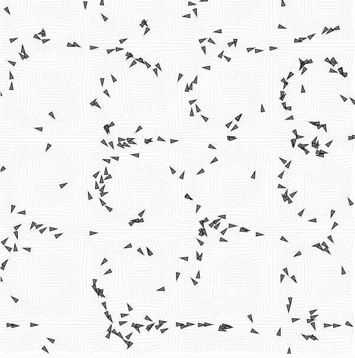

## Flow Fields

### Campo de Flujo

```js
this.field = new Array(cols * rows);
```

¿Qué representa cada elemento?
* Cada celda del array guarda un vector que indica una dirección de flujo. Los vehículos que entran a esa celda “leen” ese vector para saber hacia dónde deberían moverse.

¿Cómo se generan los vectores?
* Se suelen calcular con ruido de Perlin (noise()), para generar patrones suaves y orgánicos. El ángulo se deriva del ruido, y con ese ángulo se crea un p5.Vector con dirección determinada:

```js
let angle = noise(xoff, yoff) * TWO_PI;
let v = p5.Vector.fromAngle(angle);
this.field[index] = v;
```

### Agente

En la clase Vehicle, la función follow(flow) hace esto:

```js
let x = floor(this.pos.x / flow.resolution);
let y = floor(this.pos.y / flow.resolution);
let index = x + y * flow.cols;
let desired = flow.lookup(this.pos);
```

* Usa esa posición para obtener el vector correspondiente del campo.
* El vector deseado (del campo) es tratado como la dirección ideal del movimiento.
* Se calcula la fuerza de dirección (steering) como la diferencia entre el vector deseado y la velocidad actual:

```js
desired.setMag(this.maxspeed);
let steer = p5.Vector.sub(desired, this.vel);
steer.limit(this.maxforce);
this.applyForce(steer);
```
* Esto mantiene el movimiento suave, sin cambios bruscos, y limitado por los parámetros del vehículo.

### Parámetros clave identificados
* Resolución del campo de flujo (flow.resolution):

Define el tamaño de cada celda. Afecta la precisión y detalle del campo.

* maxspeed del agente:

Controla qué tan rápido puede ir.

* maxforce del agente:

Controla la fuerza máxima de giro o corrección que puede aplicar (para que no sea errático).

### Modificación

1. Modifiqué la generación del campo de flujo usando una fórmula trigonométrica en lugar de noise():

```js
let angle = sin(xoff) * cos(yoff) * TWO_PI;
```

2. Reducí la resolución del campo de 20 a 5 (más fino):

```js
this.resolution = 5;
```

### Observaciones:

* Con la nueva fórmula (seno/coseno):

Los vectores del campo de flujo se volvieron más regulares y simétricos, generando patrones menos orgánicos y más cíclicos. El movimiento de los agentes se volvió repetitivo, como si siguieran una coreografía circular.

* Con resolución más fina (5 px):

Los vehículos respondían a cambios más sutiles en el campo. El movimiento se volvió más frenético y detallado, pero también menos fluido: los agentes parecían “nerviosos”, reaccionando constantemente a las pequeñas variaciones.

### Código Modificado

```js
// En clase FlowField, cambio en la generación del vector
let angle = sin(xoff) * cos(yoff) * TWO_PI;
let v = p5.Vector.fromAngle(angle);
this.field[index] = v;

// Cambio en resolución
this.resolution = 5;
```

### Captura

https://editor.p5js.org/carlossanta16/sketches/RrZCG2OUk




