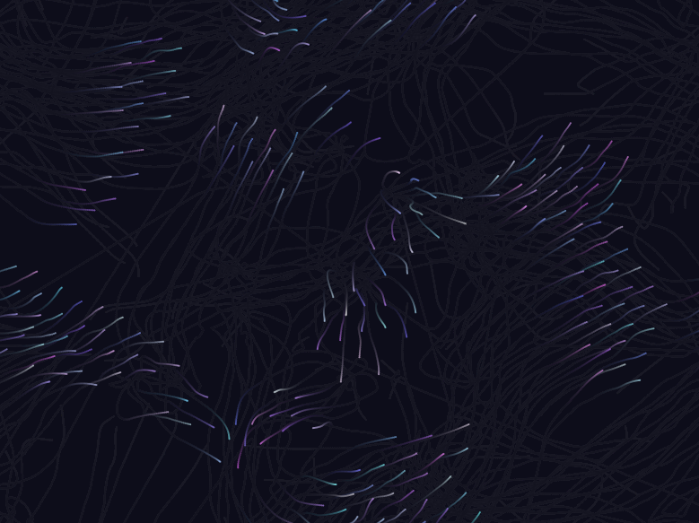

## Pieza Generativa

### Concepto de aplicación inesperada

En esta pieza, los agentes del sistema de flocking no representan aves ni partículas, sino recuerdos flotantes, imágenes mentales que navegan por la memoria.
Cada boid es una “memoria” que se mueve de forma orgánica, guiada por la lógica colectiva, como si nuestra mente intentara agrupar momentos similares, alejar los incómodos o converger en un recuerdo en común.

Visualmente, los boids dejan un rastro borroso, como las imágenes en la mente que no terminan de definirse. El usuario puede guiar el flujo de estas memorias con el mouse, como si intentara enfocar o alterar el curso del pensamiento.

### Adaptación del algoritmo

Tomé el código de flocking de Daniel Shiffman y realicé los siguientes cambios:

Reemplacé las formas geométricas por trazos suaves con transparencias.

Implementé líneas curvas que conectan los boids, como si formaran redes de recuerdos.

Añadí un gradiente de color tenue que cambia según la velocidad del boid, evocando emoción o intensidad del recuerdo.

El mouse actúa como un campo de atención: los recuerdos se sienten atraídos (cohesión + seek).

Se removió el concepto tradicional de "boid con alas o punta", y ahora son formas difusas o líneas, como fantasmas de pensamientos.

### Interacción implementada

MousePressed: Agrega nuevos “recuerdos” (boids) en la posición del mouse.

MouseDragged: Influye en la dirección del pensamiento colectivo (aplica seek hacia el mouse).

Tecla 'C': Limpia la pantalla como si fuese un borrón mental.

Color y transparencia: reflejan la intensidad o el desgaste del recuerdo.

### Prueba 100% real

https://editor.p5js.org/carlossanta16/sketches/f5yi7Lc6G
