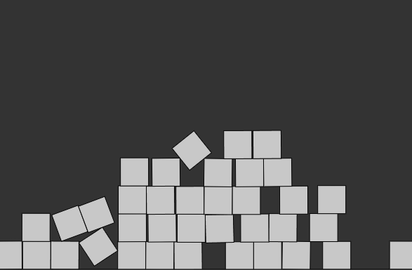
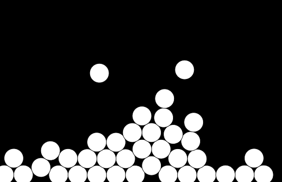

## Matter.js

### Conceptos Clave
* Engine: Es el motor que corre la simulación. Se encarga de calcular la física (movimiento, colisiones, fuerzas, etc.) en cada cuadro.

* World: Es como el contenedor de todo: aquí se agregan los cuerpos, restricciones, y demás elementos que se van a simular.

* Bodies: Son los objetos físicos. Hay distintos tipos como Bodies.rectangle, Bodies.circle, etc. Pueden ser dinámicos (se mueven con la física) o estáticos (como el suelo).

* Constraint: Une dos cuerpos como si fuera una cuerda o resorte. Puede servir para simular cadenas, huesos o cuerdas. (No usé este en mis ejemplos por ser opcional).

* MouseConstraint: Permite interactuar con los cuerpos usando el mouse (arrastrarlos, empujarlos).

* Runner/Events: Runner actualiza la física en cada frame, y los Events permiten reaccionar cuando pasa algo (colisiones, clics, etc.).

### Experimentos

1.
``` js
// Requiere incluir matter.js y p5.js
let Engine = Matter.Engine,
    World = Matter.World,
    Bodies = Matter.Bodies;

let engine, world;
let boxes = [];
let ground;

function setup() {
  createCanvas(600, 400);
  engine = Engine.create();
  world = engine.world;

  // Suelo estático
  let options = {
    isStatic: true
  };
  ground = Bodies.rectangle(300, height, 600, 20, options);
  World.add(world, ground);
}

function mousePressed() {
  // Crear cajas nuevas donde se haga clic
  boxes.push(Bodies.rectangle(mouseX, mouseY, 40, 40));
  World.add(world, boxes[boxes.length - 1]);
}

function draw() {
  background(51);
  Engine.update(engine);

  // Mostrar las cajas
  for (let b of boxes) {
    push();
    translate(b.position.x, b.position.y);
    rotate(b.angle);
    rectMode(CENTER);
    fill(200);
    rect(0, 0, 40, 40);
    pop();
  }

  // Mostrar el suelo
  push();
  fill(100);
  rectMode(CENTER);
  rect(ground.position.x, ground.position.y, 600, 20);
  pop();
}
```



2.
``` js
let Engine = Matter.Engine,
    World = Matter.World,
    Bodies = Matter.Bodies,
    Mouse = Matter.Mouse,
    MouseConstraint = Matter.MouseConstraint;

let engine, world;
let boxes = [];
let ground;
let mConstraint;

function setup() {
  let canvas = createCanvas(600, 400);
  engine = Engine.create();
  world = engine.world;

  // Suelo
  ground = Bodies.rectangle(300, height, 600, 20, { isStatic: true });
  World.add(world, ground);

  // Mouse constraint
  let canvasMouse = Mouse.create(canvas.elt);
  canvasMouse.pixelRatio = pixelDensity();
  let options = {
    mouse: canvasMouse
  };
  mConstraint = MouseConstraint.create(engine, options);
  World.add(world, mConstraint);
}

function mousePressed() {
  boxes.push(Bodies.circle(mouseX, mouseY, 20));
  World.add(world, boxes[boxes.length - 1]);
}

function draw() {
  background(0);
  Engine.update(engine);

  for (let b of boxes) {
    push();
    translate(b.position.x, b.position.y);
    rotate(b.angle);
    fill(255);
    ellipse(0, 0, 40);
    pop();
  }

  push();
  fill(150);
  rectMode(CENTER);
  rect(ground.position.x, ground.position.y, 600, 20);
  pop();
}
```



### Dificultades

* Integrar p5.js y Matter.js me tomó un rato. Tuve que asegurarme de importar correctamente Matter.js en el HTML o incluirlo como script externo en el editor que usé (por ejemplo, usando CDN si trabajas en editor web).

* El uso de MouseConstraint fue algo confuso al principio porque hay que crear el mouse desde el canvas de p5, no solo usar mouseX y mouseY.
