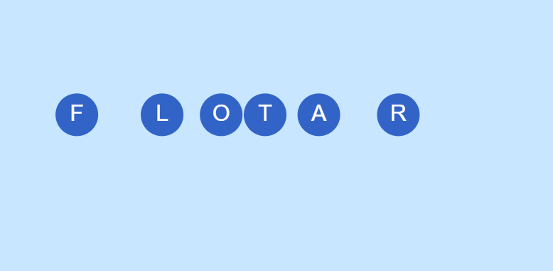

## Flotar

### Idea

* Cada letra de la palabra "flotar" está formada por cuerpos suaves, redondeados (círculos y elipses).

* Están suspendidas en el aire con una gravedad invertida, como si estuvieran en el agua o flotando en una nube.

* Se mueven lentamente de un lado a otro gracias a una fuerza de oscilación senoidal.

* Al mover el mouse, las perturbas suavemente, como si agitaras el aire o el agua.

### Aspectos técnicos

* Gravedad negativa (gravity.y = -0.05) para que suban en vez de caer.

* Cuerpos circulares o redondeados (Bodies.circle) con restitución alta (elasticidad), baja fricción.

* Movimiento oscilatorio con sin(frameCount) que aplica fuerzas laterales suaves.

* MouseConstraint para interactuar como si los empujaras flotando.

## Obra

``` js
let Engine = Matter.Engine,
    World = Matter.World,
    Bodies = Matter.Bodies,
    Body = Matter.Body,
    Mouse = Matter.Mouse,
    MouseConstraint = Matter.MouseConstraint;

let engine, world;
let letters = [];
let mConstraint;

function setup() {
  createCanvas(800, 400);
  engine = Engine.create();
  world = engine.world;

  // Gravedad invertida
  engine.world.gravity.y = -0.05;

  // Crear las letras con círculos (más suaves visualmente)
  let spacing = 100;
  let startX = 100;
  let y = height / 2;

  for (let i = 0; i < 6; i++) {
    let b = Bodies.circle(startX + i * spacing, y, 30, {
      restitution: 1,
      friction: 0.01,
      density: 0.001
    });
    letters.push(b);
    World.add(world, b);
  }

  // Mouse constraint
  let canvasmouse = Mouse.create(canvas.elt);
  canvasmouse.pixelRatio = pixelDensity();
  let options = {
    mouse: canvasmouse
  };
  mConstraint = MouseConstraint.create(engine, options);
  World.add(world, mConstraint);
}

function draw() {
  background(200, 230, 255);
  Engine.update(engine);

  // Aplicar fuerza oscilatoria
  for (let i = 0; i < letters.length; i++) {
    let force = sin(frameCount * 0.02 + i) * 0.0002;
    Body.applyForce(letters[i], letters[i].position, { x: force, y: 0 });
  }

  // Dibujar letras con forma flotante
  noStroke();
  textSize(32);
  textAlign(CENTER, CENTER);
  fill(50, 100, 200);

  let word = "FLOTAR";
  for (let i = 0; i < letters.length; i++) {
    let pos = letters[i].position;
    ellipse(pos.x, pos.y, 60, 60); // burbuja
    fill(255);
    text(word[i], pos.x, pos.y);
    fill(50, 100, 200);
  }
}

```


